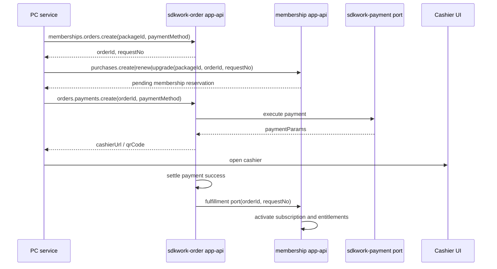

# Membership Technical Architecture

Status: active
Owner: SDKWork maintainers
Updated: 2026-07-08
Specs: ARCHITECTURE_DECISION_SPEC.md, RUST_CODE_SPEC.md, API_SPEC.md, SDK_SPEC.md, WEB_FRAMEWORK_SPEC.md, WEB_BACKEND_SPEC.md, DATABASE_FRAMEWORK_SPEC.md, APP_SDK_INTEGRATION_SPEC.md, DOCUMENTATION_SPEC.md

## 1. Architecture Overview

`sdkwork-membership` is a commerce-domain T1 capability repository. It owns membership catalog, subscription reservation, entitlement fulfillment, membership points projection, daily rewards, privilege usage, HTTP API routes, SQLx persistence, database lifecycle assets, generated SDK surfaces, and an embeddable PC application.

It does not own unified order creation or payment settlement. Token plan purchase orders and membership package purchase orders are created by `sdkwork-order`. Payment intents, attempts, cashier parameters, PSP webhooks, refunds, and settlement execution are owned by `sdkwork-order` and `sdkwork-payment`. Membership fulfills only after order settlement calls the membership fulfillment port.

```text
sdkwork-specs
  -> sdkwork-web-framework + sdkwork-database + sdkwork-utils
    -> sdkwork-membership Rust crates
      -> app-api/backend-api route adapters
      -> SQLx membership repositories
      -> standalone gateway and service host
    -> sdks/sdkwork-membership-app-sdk
    -> apps/sdkwork-membership-pc
```

## 2. Technology Choices

- Rust domain services and SQLx repositories follow `RUST_CODE_SPEC.md`.
- HTTP routes use Axum through `sdkwork-web-framework` and `sdkwork-web-bootstrap`.
- Database lifecycle, migrations, seeds, and drift checks use `sdkwork-database`.
- Shared validation, string, datetime, number, currency, and HTTP API helpers should use `sdkwork-utils` before adding local utility code.
- Frontend integration follows `UI -> service class -> composed SDK facade -> generated SDK`.
- TypeScript code in this repository imports the scoped composed `@sdkwork/membership-app-sdk` only; product composition roots own order SDK integration.

## 3. System Boundaries And Modules

| Layer | Owner | Responsibility |
| --- | --- | --- |
| Domain service | `crates/sdkwork-membership-service` | Domain models, validation, commands, queries, ports |
| SQL repository | `crates/sdkwork-membership-repository-sqlx` | Tenant-scoped persistence and membership read/write adapters |
| App API routes | `crates/sdkwork-routes-membership-app-api` | `/app/v3/api/memberships` route adapter |
| Backend API routes | `crates/sdkwork-routes-membership-backend-api` | `/backend/v3/api/memberships` route adapter |
| Database host | `crates/sdkwork-membership-database-host` | Database lifecycle bootstrap |
| Service host | `crates/sdkwork-membership-service-host` | In-process service container |
| Standalone gateway | `crates/sdkwork-membership-standalone-gateway` | HTTP process entrypoint |
| Gateway assembly | `crates/sdkwork-membership-gateway-assembly` | Route assembly manifest |
| App SDK | `sdks/sdkwork-membership-app-sdk` | Owner-only membership app-api SDK family |
| PC app | `apps/sdkwork-membership-pc` | PC React shell and membership UI/service packages |

No membership crate or TypeScript package may depend on `sdkwork-order` crates, SDKs, services, or UI packages. Membership exposes a host-injected checkout port; product application roots supply its order-owned implementation.

`sdkwork-order` is the backend capability that depends on membership through the fulfillment port; membership does not depend on order packages, SDKs, services, UI, Rust crates, or order/payment database lifecycle assets.

## 4. Web Framework Integration

App-api and backend-api route crates are mounted through the standard web framework chain:

```text
sdkwork-web-axum
  -> WebFrameworkLayer
  -> with_web_request_context(router, layer)
  -> IamWebRequestContextResolver
  -> handler receives WebRequestContext
```

Handlers do not parse credential, tenant, organization, user, request id, or trace headers manually. Success responses use `SdkWorkApiResponse`; errors map to `application/problem+json` with numeric `code` and `traceId`.

## 5. API, SDK, And Frontend Composition

### 5.1 Membership App API

Membership app-api owns membership resources only:

- levels/plans
- benefits
- package groups
- packages
- membership summary
- points
- daily rewards
- privilege usage
- purchase/renew/upgrade reservation

Purchase/renew/upgrade request bodies accept membership reservation inputs such as `packageId`, `orderId`, `requestNo`, and optional `couponId`. They do not accept `paymentMethod`.

Purchase/renew/upgrade responses return membership reservation data only:

- `requestNo`
- `orderId`
- `packageId`
- `packageName`
- `amount`
- `durationDays`
- `targetPlanRank`
- `targetPlanName`
- `status`

They do not return payment provider, payment method, payment id, next action, cashier URL, QR payload, QR image, or request-payment payload.

### 5.2 SDK Family

The owner-only SDK family is:

```text
sdks/sdkwork-membership-app-sdk/
  openapi/sdkwork-membership-app-api.sdkgen.json
  sdkwork-membership-app-sdk-typescript/
    src/index.ts
    generated/server-openapi/
```

The composed facade package is `@sdkwork/membership-app-sdk`. Generated transport remains under `generated/server-openapi` and is regenerated from OpenAPI. Consumers must not import generator transport names or deep paths.

`sdk-manifest.json` is the required per-family SDK metadata source of truth and must stay aligned with `specs/component.spec.json`.

### 5.3 PC Service Flow

The PC UI keeps its existing visual design. The service layer composes the checkout flow:

```text
membership UI
  -> membership service class
  -> orderAppService.memberships.orders.create({ packageId, paymentMethod })
  -> membershipAppService.memberships.purchases.create|renew|upgrade({ packageId, orderId, requestNo, couponId? })
  -> orderAppService.orders.payments.create(orderId, { paymentMethod })
  -> order paymentParams supply cashierUrl/qrCode to the UI state
```

The membership service may pass `paymentMethod` to order SDK methods. It must not pass `paymentMethod` to membership reservation SDK methods.

`@sdkwork/membership-pc-subscription` does not import `@sdkwork/payment-pc-payment` or `@sdkwork/payment-service`; payment-method UI choices are local order checkout inputs and payment execution remains behind `sdkwork-order` / `sdkwork-payment` ports.

## 6. Database Ownership

The membership database lifecycle initializes 18 membership capability tables:

| Category | Tables |
| --- | --- |
| Catalog | `commerce_product_spu`, `commerce_product_sku`, `membership_plan`, `membership_plan_version`, `benefit_definition`, `membership_plan_benefit`, `membership_package_group`, `membership_package` |
| Subscription | `membership_subscription`, `membership_period` |
| Entitlements | `entitlement_account`, `entitlement_grant`, `entitlement_ledger_entry` |
| Points projection | `commerce_account`, `commerce_account_ledger` |
| Membership extensions | `commerce_membership_daily_reward`, `commerce_membership_privilege_usage`, `commerce_membership_change_log` |

The baseline and seeds must not initialize:

- `commerce_order`, `commerce_order_item`, `commerce_order_amount_breakdown`
- `commerce_payment_intent`, `commerce_payment_attempt`, `commerce_payment_method`
- `commerce_payment_provider`, `commerce_payment_provider_account`
- `commerce_payment_channel`, `commerce_payment_route_rule`
- `commerce_recharge_package`, `commerce_exchange_rule`

Membership may persist order references needed for reservation and fulfillment through `source_order_id` and `request_no`. It must not persist payment intent, payment attempt, payment method, provider, cashier, QR, or request-payment fields.

## 7. Checkout And Fulfillment Boundary

The production checkout model is order-first:



Dependency rules:

```text
sdkwork-order -> sdkwork-payment
sdkwork-order -> sdkwork-membership fulfillment port
frontend membership service -> @sdkwork/membership-app-sdk
application composition root -> sdkwork-membership + sdkwork-order
application composition root -> inject order-owned checkout port and UI
sdkwork-payment MUST NOT -> sdkwork-order | sdkwork-membership
membership MUST NOT -> sdkwork-order packages, SDKs, services, UI, or Rust crates
membership MUST NOT -> INSERT commerce_order
```

Authority:

- `specs/commerce-order-membership-boundary.spec.json`
- `specs/COMMERCE_ORDER_BOUNDARY_SPEC.md`
- `../sdkwork-order/specs/commerce-checkout-topology.spec.json`
- `../sdkwork-payment/specs/commerce-dependency-boundary.spec.json`

## 8. Security, Privacy, And Observability

- Authentication and tenant context come from `sdkwork-web-framework` request context.
- API errors use `ProblemDetail`; internal SQL and provider details are not leaked.
- Idempotency is enforced for reservation, fulfillment, reward, and privilege mutation paths.
- Tenant and organization predicates are applied in repository queries.
- Payment credentials, PSP payloads, card data, and payment provider secrets are never stored in membership tables.
- Logs may include order id/request number for correlation, but not payment tokens, cashier secrets, PSP signatures, or raw credential values.

## 9. Deployment And Runtime Topology

Local split-gateway development:

```text
sdkwork-order-standalone-gateway      owns order app-api and order/payment checkout
sdkwork-membership-standalone-gateway owns membership app-api/backend-api
sdkwork-membership-pc                 consumes @sdkwork/membership-app-sdk only
product application root             composes order checkout with membership checkout port
```

PC runtime SDK base URL binding:

```text
VITE_SDKWORK_MEMBERSHIP_PC_APP_API_BASE_URL -> @sdkwork/membership-app-sdk
```

`apps/sdkwork-membership-pc/sdkwork.app.config.json` owns the schema-v2 `envBindings` contract for the membership Vite key. The manifest records `backend.appId = sdkwork-membership-pc`, `preset = vite-react-standard`, and the membership SDK base URL mapping. Tracked `.env.example` files and shell bootstrap must stay aligned with that manifest contract.

The membership PC shell does not bootstrap an order SDK and does not declare an order SDK base URL. This repository does not declare `VITE_SDKWORK_MEMBERSHIP_PC_SDK_BASE_URL` or any other common SDK base URL fallback. Product applications own their order runtime configuration and inject checkout through the membership port.

Composed platform deployment:

```text
shared platform gateway/order service
  -> order app-api
  -> payment execution
  -> membership fulfillment port

membership capability
  -> membership app-api/backend-api
  -> membership database lifecycle
```

Local end-to-end checkout requires the order/payment modules to run their own database lifecycles. Membership must not add order/payment DDL or seeds to make local checkout convenient.

## 10. Verification

Narrow verification for this boundary:

```bash
node --test --test-reporter=spec --experimental-strip-types tests/static/membership-standards-regression.test.mjs
cargo test -p sdkwork-membership-service --test membership_standard -- --nocapture
cargo test -p sdkwork-membership-repository-sqlx --test membership_sqlx_standard -- --nocapture
pnpm test:vitest -- apps/sdkwork-membership-pc/packages/sdkwork-membership-pc-membership/tests/membership.service.test.ts
```

Contract and standard verification:

```bash
pnpm run db:materialize:contract
pnpm run sdk:generate
node ../sdkwork-specs/tools/check-app-sdk-consumer-imports.mjs --workspace .
node ../sdkwork-specs/tools/check-api-operation-patterns.mjs --workspace .
node ../sdkwork-specs/tools/check-api-response-envelope.mjs --workspace .
node ../sdkwork-specs/tools/check-database-framework-standard.mjs --root .
node ../sdkwork-specs/tools/verify-repo.mjs --root .
node ../sdkwork-specs/tools/check-agent-workflow-standard.mjs --root .
node ../sdkwork-specs/tools/check-pnpm-script-standard.mjs --root .
```
