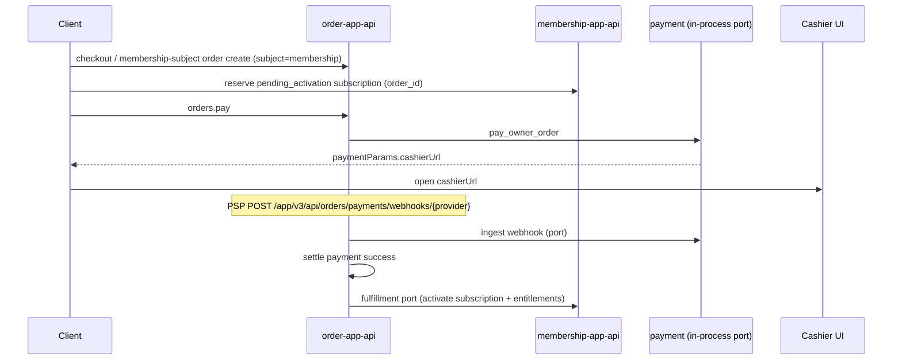

# Membership Technical Architecture

Status: active
Owner: SDKWork maintainers
Updated: 2026-07-06
Specs: ARCHITECTURE_DECISION_SPEC.md, RUST_CODE_SPEC.md, API_SPEC.md, WEB_FRAMEWORK_SPEC.md, DATABASE_FRAMEWORK_SPEC.md, DRIVE_SPEC.md, DISCOVERY_SPEC.md, SDKWORK_WORKSPACE_SPEC.md

## 1. Architecture Overview

`sdkwork-membership` is a **commerce-domain capability repository** that owns membership plans, packages, entitlements, points, and subscription domain logic. It follows the standard SDKWork repository architecture with self-contained API server, database host, and web framework integration.

```text
sdkwork-specs (L0)
  WEB_FRAMEWORK_SPEC.md, DATABASE_FRAMEWORK_SPEC.md, RUST_CODE_SPEC.md
       -> narrows
sdkwork-web-framework + sdkwork-database + sdkwork-utils (L1 frameworks)
       -> extended by
sdkwork-membership crates (L2 business)
  sdkwork-membership-service                    — domain rules, commands, ports
  sdkwork-membership-repository-sqlx            — SQLx persistence, route adapters
  sdkwork-routes-membership-app-api             — app-api route adapter
  sdkwork-routes-membership-backend-api         — backend-api route adapter
  sdkwork-membership-database-host              — database lifecycle bootstrap
  sdkwork-membership-service-host               — in-process service container
  sdkwork-membership-standalone-gateway         — HTTP process entry point
  sdkwork-membership-gateway-assembly           — route assembly manifest
       -> consumed by
composition applications (sdkwork-mall, etc.) via workspace path dependencies
```

## 2. Technology Choices

- **Rust** domain services and SQLx repositories (`RUST_CODE_SPEC.md`)
- **Axum** HTTP routers integrated via `sdkwork-web-framework` (`WEB_FRAMEWORK_SPEC.md`)
- **sdkwork-database** for connection pools, lifecycle orchestration, and SPI (`DATABASE_FRAMEWORK_SPEC.md`)
- **sdkwork-utils-rust** for cross-language utility functions — eliminates duplicate validation, string, and number helpers (`GENERIC_UTILS_SCOPE.md`)
- **sdkwork-iam-web-adapter** for `WebRequestContext` resolution and IAM token validation
- **Sibling path dependencies** from this repository's `Cargo.toml` — cross-T1 references use `sdkwork_commerce_*` crate names per `sdkwork-<domain>-<capability>-service` naming

## 3. System Boundaries And Modules

| Layer | Owner crate | Responsibility |
| --- | --- | --- |
| Domain commands/queries | `sdkwork-membership-service` | Business validation, domain models, ports, service contracts |
| SQL repositories | `sdkwork-membership-repository-sqlx` | Tenant-scoped persistence, row mapping, route adapters |
| App API routes | `sdkwork-routes-membership-app-api` | `/app/v3/api/membership` route adapter with `WebRequestContext` |
| Backend API routes | `sdkwork-routes-membership-backend-api` | `/backend/v3/api/membership` route adapter with `WebRequestContext` |
| Database lifecycle | `sdkwork-membership-database-host` | Pool creation, `DefaultDatabaseModule`, migration orchestration |
| Service container | `sdkwork-membership-service-host` | In-process service container (no HTTP listener) |
| API server | `sdkwork-membership-standalone-gateway` | Process startup, route mounting, HTTP listener, health |
| Gateway assembly | `sdkwork-membership-gateway-assembly` | Route inventory manifest, assembly bootstrap |

## 4. Web Framework Integration

Both app-api and backend-api route crates wrap their routers through `sdkwork-web-framework`:

```text
sdkwork-web-axum::WebFrameworkLayer
  -> with_web_request_context(router, layer)
  -> IamWebRequestContextResolver (dual-token resolution)
  -> WebRequestContext injected into handlers
```

- CORS is deny-by-default, handled by the framework standard interceptor chain.
- `WebRequestContext` is resolved once at the framework boundary.
- Handlers do not parse raw credential, tenant, or request-id headers.
- The API server uses `sdkwork_web_bootstrap::service_router` for final assembly.

## 5. Database Framework Integration

```text
sdkwork-database-sqlx::create_pool_from_config
  -> DatabasePool (Postgres | SQLite)
  -> sdkwork-database-spi::DefaultDatabaseModule::from_app_root
  -> LifecycleOrchestrator (init + optional auto-migrate)
```

- Standard `database/` directory with `database.manifest.json`, contract, migrations, seeds, and drift policy.
- Connection pools created through `sdkwork-database-sqlx`.
- Lifecycle orchestration uses `sdkwork-database-lifecycle`.
- Seed data is installed through the `sdkwork-database-cli` seed mechanism declared in `database/seeds/seed.manifest.json`.

### 5.1 Table Ownership

| Ownership | Tables | Description |
| --- | --- | --- |
| **Membership-owned** | `commerce_membership_daily_reward`, `commerce_membership_privilege_usage`, `commerce_membership_change_log` | Extension tables created by baseline DDL `0001_membership_baseline.sql`. Follow `DATABASE_SPEC.md` with `uuid`, `version`, audit fields, and idempotency constraints. |
| **Commerce platform (shared)** | `membership_plan`, `membership_plan_version`, `membership_plan_benefit`, `membership_package_group`, `membership_package`, `membership_subscription`, `membership_period`, `benefit_definition`, `entitlement_account`, `entitlement_grant`, `entitlement_ledger_entry` | Domain tables created by the commerce platform initial migration. This repo reads and writes via repository adapters. Registered in contract for drift detection. |
| **Commerce platform (reference)** | `commerce_product_spu`, `commerce_product_sku`, `commerce_order`, `commerce_order_item`, `commerce_order_amount_breakdown`, `commerce_payment_intent`, `commerce_payment_attempt`, `commerce_account`, `commerce_account_ledger`, `commerce_payment_method`, `commerce_payment_provider`, `commerce_payment_provider_account`, `commerce_payment_channel`, `commerce_payment_route_rule`, `commerce_recharge_package`, `commerce_exchange_rule` | Cross-capability commerce tables accessed via port interfaces. No direct write ownership. |

### 5.2 Migration Strategy

- Baseline DDL `database/ddl/baseline/*/0001_membership_baseline.sql` creates membership-owned extension tables and aligns commerce platform table columns via idempotent `ALTER TABLE` where required.
- Performance indexes are created for high-frequency query patterns: tenant-scoped status lookups, subscription expiration scanning, and entitlement account balance queries.
- All migrations support both PostgreSQL and SQLite engines.
- Down migrations safely drop extension tables; ALTER TABLE additions are preserved to avoid data loss.

### 5.3 Contract Registry

- `contract/schema.yaml` registers all 30 tables with table profile, compliance level, system-of-record flag, and write-owner attribution.
- `contract/table-registry.json` provides machine-readable table inventory with migration source and `referenceOnly` flags.
- `contract/prefix-registry.json` registers the `commerce_` prefix owned by `sdkwork-membership`.
- Drift policy enforces error-level severity for missing tables, columns, constraints, and migration checksums.

## 6. sdkwork-utils Integration

The service crate uses `sdkwork-utils-rust` for:
- `string::is_blank` — empty/blank validation
- `number::parse_int` — numeric context parsing
- Centralized `normalize_optional_text` in `validation` module eliminates duplicate implementations across `domain` and `queries` modules.

## 7. Discovery And RPC

This repository currently exposes only HTTP APIs and has no gRPC/RPC services. `sdkwork-discovery` is not required. When RPC services are added, they MUST follow `DISCOVERY_SPEC.md` and register through `sdkwork-discovery`.

## 8. Drive And File Storage

The current membership capability does not involve file upload or object storage. If file upload is needed in the future (e.g., membership card icons, benefit images), it MUST use `sdkwork-drive` integration:
- Client uploads via `sdkwork-drive-app-sdk` `client.uploader.*`
- Server-side Rust uploads via `sdkwork_drive_uploader_service`
- Business tables store only `drive_space_id`, `drive_node_id`, or `drive_uri` references

## 9. Directory And Package Layout

```text
sdkwork-membership/
  database/                          — standard database lifecycle assets
    database.manifest.json
    contract/schema.yaml
    contract/prefix-registry.json
    contract/table-registry.json
    migrations/postgres/
    migrations/sqlite/
    seeds/seed.manifest.json
    seeds/common/
    seeds/locales/zh-CN/
    drift/policy.yaml
    fixtures/
  crates/
    sdkwork-membership-service/              — domain rules
    sdkwork-membership-repository-sqlx/       — SQLx persistence, route adapters
    sdkwork-routes-membership-app-api/        — app-api routes
    sdkwork-routes-membership-backend-api/    — backend-api routes
    sdkwork-membership-database-host/         — database bootstrap
    sdkwork-membership-service-host/          — service container
    sdkwork-membership-standalone-gateway/    — HTTP process
    sdkwork-membership-gateway-assembly/     — route assembly
  apps/sdkwork-membership-common/packages/     — TypeScript contracts, SDK ports, and service facade
  apps/sdkwork-membership-pc/                  — PC application root
  docs/                                        — documentation canon
```

## 10. API Surface

### 10.1 Purchase, Renew, And Upgrade Persistence

`repository-sqlx` resolves purchase bindings in `shared::resolve_membership_purchase_binding`:

| Action | Subscription row | Period | Entitlements |
| --- | --- | --- | --- |
| `purchase` | `INSERT` new `membership_subscription` | `INSERT` pending period | `INSERT` grants/accounts |
| `renew` | `UPDATE` existing subscription | `INSERT` pending period from `max(expires_at, requested_at)` | skipped (extend only) |
| `upgrade` | `UPDATE` plan/package on existing subscription | `INSERT` pending period | `INSERT` upgraded grants |

Idempotency replays key on `(tenant_id, organization_id, owner_user_id, idempotency_key)`. API `orderId` returns commerce order UUID; `requestNo` returns human order number.

### 10.2 Catalog Scope

Guest catalog reads use `resolve_catalog_scope(subject)` — authenticated subjects use their tenant/org; guests fall back to seeded demo tenant `100001` for standalone browsing until host apps inject tenant context.

Catalog data is authoritative from SQL when the gateway runs with SQLx stores. Seed file `database/seeds/common/001_bootstrap.sql` materializes:

| Package group (`external_id`) | Billing cycle | Packages (`external_id`) |
| --- | --- | --- |
| 1 连续包年 | year / 365d | 101–103 (basic / standard / premium) |
| 2 连续包月 | month / 30d | 201–203 |
| 3 连续包季 | quarter / 90d | 301–303 |
| 4 单月购买 | once / 30d | 401–403 |

PC subscription catalog integration:

| Layer | Responsibility |
| --- | --- |
| `@sdkwork/membership-app-sdk` | HTTP transport for `memberships.packageGroups.list`, `plans.list`, `benefits.list`, `purchases.*` |
| `subscription-catalog-service` | SDK orchestration, ViewModel mapping, purchase action resolution |
| `subscription-catalog-controller` | Page state, billing-cycle selection, checkout lifecycle |
| `SubscriptionCatalogPage` | Preserves existing UI components; consumes controller state only |
| `SdkworkSubscriptionCatalogScreen` | Shell-ready screen with default host modals and SDK bootstrap |

Package display tags are persisted on `commerce_product_sku.spec_json.tags` and projected by repository read models into `AppMembershipPackageItem.tags`.

### 10.3 Commerce Checkout, Payment, And Fulfillment Boundaries

Membership purchases follow the same **order-center-first** model as `points_recharge` and product checkout. **`commerce_order` creation, `orders.pay`, PSP webhooks, and payment settlement are owned by order.** Membership owns subscription/entitlement tables and fulfillment after payment success.

| Capability | Repository | Role in membership purchase |
| --- | --- | --- |
| **Payment** | `sdkwork-payment` | Payment executor: intents, attempts, provider channels, refunds; webhook event persistence **via port only** |
| **Order** | `sdkwork-order` | **Creates `commerce_order`** (`subject=membership`), `orders.pay`, **PSP webhook ingestion**, settlement; invokes membership fulfillment port |
| **Membership** | `sdkwork-membership` (this repo) | Catalog + `pending_activation` subscription reservation + **fulfillment** (activate + entitlements) |

**Dependency direction (mandatory):**

```text
sdkwork-order  →  sdkwork-payment      (in-process stores / payment-providers)
sdkwork-order  →  sdkwork-membership   (MembershipPurchaseFulfillmentPort at gateway settlement)
sdkwork-membership  →  @sdkwork/order-app-sdk, @sdkwork/payment-app-sdk   (client consumer only)
payment  MUST NOT  →  order | membership
membership  MUST NOT  →  sdkwork-order-* crates | INSERT commerce_order
```

Machine contract: `specs/commerce-order-membership-boundary.spec.json`. Human spec: `specs/COMMERCE_ORDER_BOUNDARY_SPEC.md`.

Authoritative cross-repo references:

- `../sdkwork-order/docs/architecture/commerce/COMMERCE_CHECKOUT_ARCHITECTURE.md`
- `../sdkwork-order/specs/RECHARGE_ORDER_SPEC.md` (create/pay boundary reference)
- `../sdkwork-order/docs/product/prd/PRD.md` §11 Fulfillment Boundaries
- `../sdkwork-payment/AGENTS.md` §Capability Dependency Boundary

**Normative membership purchase flow (production / composed):**



Key rules:

- **Order create** writes order domain only (`commerce_order`, items, breakdown). Payment intent/attempt is created by **`orders.pay`**, not at membership purchase API (same rule as `RECHARGE_ORDER_SPEC.md` §7).
- Production PSP notify URL: `POST /app/v3/api/orders/payments/webhooks/{providerCode}` on the **order gateway**. Legacy `POST /app/v3/api/payments/webhooks/*` returns **410 Gone**.
- Order settlement saga calls `MembershipPurchaseFulfillmentPort` after payment success (same pattern as `AccountPointsCreditPort` for `points_recharge`).
- Manual operator replay: `POST /backend/v3/api/orders/{orderId}/payment_confirmations`.

**Local vs composed deployment:**

| Mode | Order API | Membership API | Checkout client |
| --- | --- | --- | --- |
| Local dev (split gateways) | `sdkwork-order-standalone-gateway` (`:18093`) | `sdkwork-membership-standalone-gateway` (`:18096`) | PC shell Vite proxy routes order paths to order gateway |
| Composed (mall / platform) | Shared platform order app-api | Shared membership app-api | `@sdkwork/order-app-sdk` + `@sdkwork/membership-app-sdk` |

All modes use the same normative flow: order create → membership reserve → `orders.pay` → order webhook settlement → membership fulfillment.

- App API prefix: `/app/v3/api/memberships`
- Backend API prefix: `/backend/v3/api/memberships`
- Table prefix: `commerce_` for capability-owned tables (commerce domain)
- List/search responses: `SdkWorkApiResponse` with `data.items` + `data.pageInfo` per `PAGINATION_SPEC.md`
- Default `page_size`: `20`; maximum `200`
- Membership-owned extension tables: `commerce_membership_daily_reward`, `commerce_membership_privilege_usage`, `commerce_membership_change_log`
- Public SDK consumption: `@sdkwork/membership-app-sdk` composed facade via `@sdkwork/membership-service`; application code MUST NOT hand-craft raw HTTP or import generator transport package names.

## 11. Security, Privacy, And Observability

- Authentication and tenant context are resolved through `sdkwork-web-framework` standard interceptor chain.
- Both app-api and backend-api surfaces run the full `WebRequestContext` pipeline (request identity, surface classification, CORS, auth, authorization, tenant isolation, logging).
- Admin catalog mutations are tenant-scoped: `CREATE` uses `command.subject.tenant_id`; `UPDATE`/`DELETE` filter by tenant in SQL `WHERE` clauses.
- Write routes require idempotency and request-hash headers where applicable.
- Ledger, payment, and account mutations fail closed on validation errors.
- Daily reward claims enforce per-user-per-day uniqueness via database constraint and idempotency key.
- Privilege usage tracking enforces per-period uniqueness to prevent double-counting.
- Structured errors use `CommerceServiceError` contracts mapped to `application/problem+json`; internal SQL details are not leaked to clients.
- Subject scope projection follows `SUBJECT_ID_SPEC.md` — `tenant_id` and `user_id` are positive integers, `organization_id` is non-negative with 0 meaning tenant-level scope.
- Repository read-model failures propagate as dependency errors (`503`) rather than silent empty success payloads.
- Production gateway uses DB-backed stores only; builtin catalog mock is exposed only through `app_membership_router_with_builtin_catalog()` for isolated tests.

## 12. Deployment And Runtime Topology

- Local development: `pnpm dev` (PC shell on port `5186`); run **both** API gateways — `cargo run -p sdkwork-order-standalone-gateway` (`:18093`) and `cargo run -p sdkwork-membership-standalone-gateway` (`:18096`). Configure order→membership fulfillment adapter env (`SDKWORK_ORDER_MEMBERSHIP_SERVICE_AUTH_TOKEN`, `SDKWORK_MEMBERSHIP_BACKEND_API_ORIGIN`) on the order gateway.
- Independent deployment: `sdkwork-membership-standalone-gateway` binary with graceful shutdown on `SIGINT`/`SIGTERM`.
- Platform composition: composition applications (sdkwork-mall, etc.) consume per-T1 SDKs via workspace paths.
- Environment variables follow `ENVIRONMENT_SPEC.md` with `MEMBERSHIP` service code prefix.
- PC shell bootstrap: `bootstrapSdkworkMembershipAppService({ baseUrl, authToken, accessToken })` via `@sdkwork/membership-service`.

## 13. Verification

```bash
pnpm install
pnpm sdk:generate
pnpm test:vitest
pnpm test:node
cargo test --workspace
node ../sdkwork-specs/tools/check-pagination.mjs --workspace .
node ../sdkwork-specs/tools/check-api-response-envelope.mjs --workspace .
node ../sdkwork-specs/tools/check-app-sdk-consumer-imports.mjs --workspace .
node ../sdkwork-specs/tools/check-sdk-standard.mjs --workspace .
node ../sdkwork-specs/tools/verify-repo.mjs --root .
```

## 14. 容量规划 (Capacity Planning)

| 维度 | 预估 | 说明 |
| --- | --- | --- |
| 读 QPS | 500 | 会员等级、套餐、权益、积分余额等读路径，命中索引与连接池缓存。 |
| 写 QPS | 50 | 下单、签到、权益扣减、续费等写路径，受幂等与事务约束。 |
| 并发会员数 | 100,000 | 单租户峰值活跃会员规模，订阅与权益账户按 user_id 索引。 |
| 存储增长 | ~1 KB / 用户 / 月 | 含订阅记录、积分流水、签到记录、权益使用明细；按月分区或归档。 |
| 连接池 | 20–50 | 通过 `sdkwork-database-sqlx` 配置，读写分离后读池可横向扩展。 |

容量扩展策略：读路径通过只读副本与缓存层横向扩展；写路径通过分租户 (tenant_id) 分片；权益使用明细按月归档控制单表体积。

## 15. SLA 目标 (Service Level Agreement)

| 指标 | 目标 | 说明 |
| --- | --- | --- |
| 可用性 | 99.9% | 月度可用率，排除计划内维护窗口。 |
| P99 读延迟 | < 200 ms | app-api 读路径（等级、套餐、积分查询），含网络与中间件。 |
| P99 写延迟 | < 500 ms | 下单、签到、权益扣减等写路径，含事务提交。 |
| 错误率 | < 0.1% | 5xx 错误占请求总量比例，不含业务校验失败的 4xx。 |

SLA 兑现依赖：数据库连接池容量、索引覆盖（tenant_id + status + user_id 组合）、`WebRequestContext` 中间件链开销可控、**订单域 PSP webhook 结算**异步化避免阻塞下单主路径。

## 16. 灾备与备份 (Disaster Recovery)

| 维度 | 策略 | 说明 |
| --- | --- | --- |
| 数据库主从 | PostgreSQL 主从流复制 | 主库承载写流量，从库承载读流量与故障切换目标。 |
| RPO | 5 分钟 | 流复制延迟上限，故障切换时最多丢失 5 分钟写入。 |
| RTO | 30 分钟 | 从故障检测到服务恢复的目标时长，含主从切换与缓存预热。 |
| 全量备份 | 每日 1 次 | 凌晨低峰窗口执行 `pg_basebackup`，保留 30 天滚动窗口。 |
| WAL 归档 | 持续 | 开启 `archive_mode`，支持任意时间点恢复 (PITR)。 |
| 跨可用区 | 主从跨 AZ 部署 | 主库与从库分布在不同可用区，抵御单 AZ 故障。 |

SQLite 模式仅用于本地开发与测试，不承载灾备要求；生产环境强制使用 PostgreSQL 主从拓扑。

## 17. 监控 (Monitoring)

通过 Prometheus 采集指标，Grafana 渲染仪表盘，覆盖以下核心指标：

| 指标类别 | 采集项 | 采集来源 |
| --- | --- | --- |
| 流量 | HTTP QPS、按路由与方法维度 | `sdkwork-web-framework` 中间件 |
| 延迟 | P50/P95/P99 请求延迟，按读/写路径分桶 | 中间件直方图 |
| 错误率 | 4xx/5xx 计数与占比 | 中间件计数器 |
| 连接池 | 活跃连接数、空闲连接数、等待线程数、使用率 | `sdkwork-database-sqlx` 汇出 |
| 业务 | 下单量、签到量、权益扣减量、激活成功率 | 业务埋点计数器 |
| 资源 | CPU、内存、磁盘、网络 IO | node_exporter / cAdvisor |

Grafana 仪表盘按「概览 / 读路径 / 写路径 / 数据库 / 业务」分页组织，支持按租户与路由筛选。

## 18. 告警 (Alerting)

告警规则基于 Prometheus Alertmanager，分级为 P0（立即介入）/ P1（工作时间内处理）/ P2（观察）：

| 告警条件 | 级别 | 触发阈值 | 持续窗口 |
| --- | --- | --- | --- |
| 读路径 P99 延迟 | P1 | > 500 ms | 5 分钟 |
| 写路径 P99 延迟 | P1 | > 1000 ms | 5 分钟 |
| 5xx 错误率 | P0 | > 1% | 3 分钟 |
| 连接池使用率 | P1 | > 80% | 5 分钟 |
| 连接池等待线程 | P0 | > 10 | 2 分钟 |
| 下单激活成功率 | P0 | < 95% | 10 分钟 |
| 主从复制延迟 | P1 | > 30 秒 | 3 分钟 |
| 磁盘使用率 | P0 | > 90% | 5 分钟 |

告警通知通过值班通道（IM webhook）分发，P0 同时触发电话升级。

## 19. 链路追踪 (Distributed Tracing)

- **协议**：OpenTelemetry (OTLP)，通过 `sdkwork-web-framework` 中间件自动埋点。
- **traceId 透传**：`WebRequestContext` 从入站 `traceparent` / `x-trace-id` 头解析，注入响应头与日志上下文；`SdkWorkApiResponse.traceId` 返回服务端生成的 UUID 供客户端关联。
- **跨度 (Span)**：HTTP 入口、数据库查询、外部 SDK 调用（payment/promotion）各为一个 span，携带 `tenant_id`、`route`、`status` 属性。
- **采样**：生产环境头尾采样 + 错误请求全量保留，采样率默认 10%，错误请求 100%。
- **后端**：导出至 OTLP Collector，存储于 Jaeger / Tempo，保留 7 天。

## 20. 日志 (Logging)

- **格式**：结构化 JSON，包含 `timestamp`、`level`、`traceId`、`tenant_id`、`user_id`、`route`、`message`、`error` 字段。
- **级别**：`ERROR`（失败链路）、`WARN`（降级与重试）、`INFO`（关键业务事件：下单、激活、签到）、`DEBUG`（开发环境，生产关闭）。
- **采样**：INFO 级别生产采样 10%，ERROR/WARN 全量保留。
- **保留**：ERROR/WARN 保留 30 天，INFO 保留 14 天，DEBUG 不落盘。
- **脱敏**：凭据、token、支付卡号等敏感字段按 `PRIVACY_SPEC.md` 脱敏后落盘；内部 SQL 参数仅记录类型不记录值。
- **聚合**：日志经 Fluentbit 采集至 Loki / Elasticsearch，支持按 `traceId` 与 `tenant_id` 关联查询。

